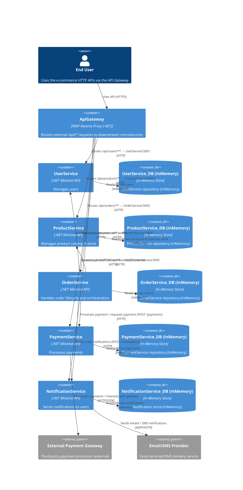

# C4 Container Diagram

> Auto-generated on 2026-09-25 08:57 UTC from commit `dd16cd1cb1ec58ded631df0a11b2057fc0444691`

```mermaid
C4Container
Person(user, "End User", "Uses the e-commerce HTTP APIs via the API Gateway")

Container(api_gateway, "ApiGateway", "YARP Reverse Proxy (.NET)", "Routes external /api/* requests to downstream microservices")
Container(user_service, "UserService", ".NET Minimal API", "Manages users")
ContainerDb(user_db, "UserService_DB (InMemory)", "In-Memory Store", "UserService repository (InMemory)")
Container(product_service, "ProductService", ".NET Minimal API", "Manages product catalog & stock")
ContainerDb(product_db, "ProductService_DB (InMemory)", "In-Memory Store", "ProductService repository (InMemory)")
Container(order_service, "OrderService", ".NET Minimal API", "Handles order lifecycle and orchestration")
ContainerDb(order_db, "OrderService_DB (InMemory)", "In-Memory Store", "OrderService repository (InMemory)")
Container(payment_service, "PaymentService", ".NET Minimal API", "Processes payments")
ContainerDb(payment_db, "PaymentService_DB (InMemory)", "In-Memory Store", "PaymentService repository (InMemory)")
Container(notification_service, "NotificationService", ".NET Minimal API", "Sends notifications to users")
ContainerDb(notification_db, "NotificationService_DB (InMemory)", "In-Memory Store", "Notification store (InMemory)")

System_Ext(payment_gateway, "External Payment Gateway", "Third-party payment processor (external)")
System_Ext(email_provider, "Email/SMS Provider", "External email/SMS delivery service")

Rel(user, api_gateway, "Uses API (HTTPS)")

Rel(api_gateway, user_service, "Routes /api/users/** → UserService:5001", "HTTP")
Rel(api_gateway, product_service, "Routes /api/products/** → ProductService:5002", "HTTP")
Rel(api_gateway, order_service, "Routes /api/orders/** → OrderService:5003", "HTTP")
Rel(api_gateway, payment_service, "Routes /api/payments/** → PaymentService:5004", "HTTP")
Rel(api_gateway, notification_service, "Routes /api/notifications/** → NotificationService:5005", "HTTP")

Rel(order_service, user_service, "Validates user / retrieves user profile", "HTTP")
Rel(order_service, product_service, "Reserves stock (POST /products/{id}/reserve)", "HTTP")
Rel(order_service, payment_service, "Processes payment / requests payment (POST /payments)", "HTTP")
Rel(order_service, notification_service, "Sends order notifications (POST /notifications)", "HTTP")

Rel(user_service, user_db, "Reads/Writes users", "InMemory")
Rel(product_service, product_db, "Reads/Writes products & reserves stock", "InMemory")
Rel(order_service, order_db, "Reads/Writes orders", "InMemory")
Rel(payment_service, payment_db, "Reads/Writes payments", "InMemory")
Rel(notification_service, notification_db, "Reads/Writes notifications", "InMemory")

Rel(payment_service, payment_gateway, "Processes payments / interacts with gateway", "HTTPS/SDK")
Rel(notification_service, email_provider, "Sends emails / SMS notifications", "SMTP/HTTP")
```
