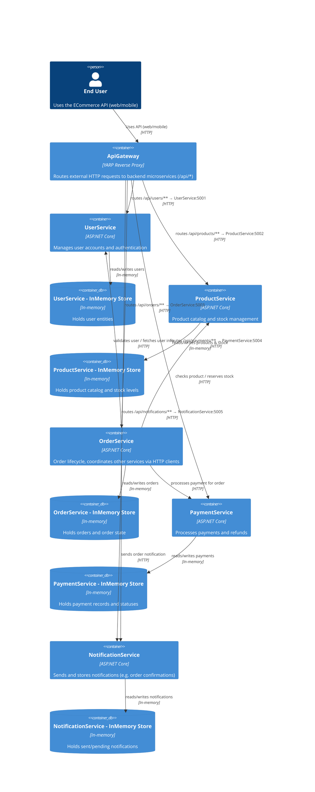

# C4 Container Diagram

> Auto-generated on 2026-09-24 15:19 UTC from commit `bc22dbac7b08ed4af270c295a699d2b09e68da0e`

```mermaid
C4Container
Person(endUser, "End User", "Uses the ECommerce API (web/mobile)")

Container(apiGateway, "ApiGateway", "YARP Reverse Proxy", "Routes external HTTP requests to backend microservices (/api/*)")
Container(userService, "UserService", "ASP.NET Core", "Manages user accounts and authentication")
ContainerDb(userDb, "UserService - InMemory Store", "In-memory", "Holds user entities")

Container(productService, "ProductService", "ASP.NET Core", "Product catalog and stock management")
ContainerDb(productDb, "ProductService - InMemory Store", "In-memory", "Holds product catalog and stock levels")

Container(orderService, "OrderService", "ASP.NET Core", "Order lifecycle, coordinates other services via HTTP clients")
ContainerDb(orderDb, "OrderService - InMemory Store", "In-memory", "Holds orders and order state")

Container(paymentService, "PaymentService", "ASP.NET Core", "Processes payments and refunds")
ContainerDb(paymentDb, "PaymentService - InMemory Store", "In-memory", "Holds payment records and statuses")

Container(notificationService, "NotificationService", "ASP.NET Core", "Sends and stores notifications (e.g. order confirmations)")
ContainerDb(notificationDb, "NotificationService - InMemory Store", "In-memory", "Holds sent/pending notifications")

Rel(endUser, apiGateway, "Uses API (web/mobile)", "HTTP")

Rel(apiGateway, userService, "routes /api/users/** → UserService:5001", "HTTP")
Rel(apiGateway, productService, "routes /api/products/** → ProductService:5002", "HTTP")
Rel(apiGateway, orderService, "routes /api/orders/** → OrderService:5003", "HTTP")
Rel(apiGateway, paymentService, "routes /api/payments/** → PaymentService:5004", "HTTP")
Rel(apiGateway, notificationService, "routes /api/notifications/** → NotificationService:5005", "HTTP")

Rel(orderService, userService, "validates user / fetches user info", "HTTP")
Rel(orderService, productService, "checks product / reserves stock", "HTTP")
Rel(orderService, paymentService, "processes payment for order", "HTTP")
Rel(orderService, notificationService, "sends order notification", "HTTP")

Rel(userService, userDb, "reads/writes users", "In-memory")
Rel(productService, productDb, "reads/writes products & stock", "In-memory")
Rel(orderService, orderDb, "reads/writes orders", "In-memory")
Rel(paymentService, paymentDb, "reads/writes payments", "In-memory")
Rel(notificationService, notificationDb, "reads/writes notifications", "In-memory")
```
